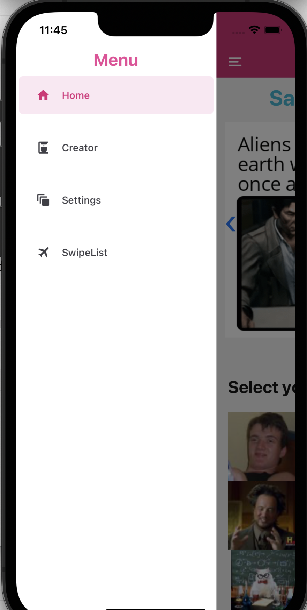

# Welcome to your Expo app 👋

This is an [Expo](https://expo.dev) project created with [`create-expo-app`](https://www.npmjs.com/package/create-expo-app).

## Get started

1. Install dependencies

   ```bash
   npm install
   ```

2. Start the app

   ```bash
    npx expo start
   ```

3. package
   ```bash
   eas secret:push --scope project --env-file .env
   eas build -p android
   eas build -p android --local
   eas build -p ios
   ```

## Demonstrate

<p></p>
<p></p>
<p></p>

## Source

- [Youtube](https://www.youtube.com/watch?v=Prf1HfVRSYo): Build a React Native Meme Creator with API Calls and Nativebase UI for iOS & Android
